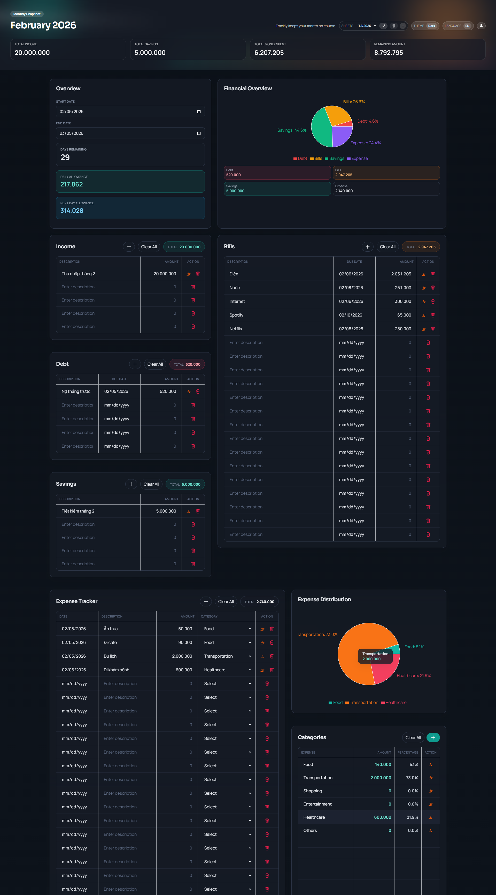

# Trackly

Modern personal expense tracker built with React, TypeScript, and Vite.

## Screenshot



## Features

- Multi-sheet budgeting with rename and remove
- Period settings with dominant month display
- Daily Allowance that locks for the day and a Next Day Allowance preview
- Detailed income, savings, debt, bills, and expenses tracking
- Category management and expense distribution chart
- Auth: email/password login, register, forgot password
- Email verification and password reset via Firebase
- Cloud sync per user (Firestore)
- Light/dark theme toggle, language toggle, responsive layout
- Polished loading and auth screens with animations

## Tech Stack

- React 18
- TypeScript
- Vite 5
- Tailwind CSS
- Firebase (Auth + Firestore)
- date-fns
- Recharts

## Getting Started

### Prerequisites

- Node.js 18+
- npm

### Install

```bash
npm install
```

### Configure Firebase

1. Create a Firebase project.
2. Add a Web app and copy the config values.
3. Enable Email/Password in Authentication.
4. Create a Firestore database.

Create a `.env` file (see `.env.example`) with:

```
VITE_FIREBASE_API_KEY=...
VITE_FIREBASE_AUTH_DOMAIN=...
VITE_FIREBASE_PROJECT_ID=...
VITE_FIREBASE_STORAGE_BUCKET=...
VITE_FIREBASE_MESSAGING_SENDER_ID=...
VITE_FIREBASE_APP_ID=...
```

### Firestore Rules

Use this rule set to restrict access to each user:

```
rules_version = '2';
service cloud.firestore {
  match /databases/{database}/documents {
    match /users/{userId} {
      allow read, write: if request.auth != null && request.auth.uid == userId;
    }
  }
}
```

If you later store data in subcollections:

```
rules_version = '2';
service cloud.firestore {
  match /databases/{database}/documents {
    match /users/{userId}/{document=**} {
      allow read, write: if request.auth != null && request.auth.uid == userId;
    }
  }
}
```

### Run Dev Server

```bash
npm run dev
```

Open `http://localhost:5173/Trackly/`.

### Build

```bash
npm run build
```

## Usage

1. Sign up or sign in.
2. Set your period dates in Overview.
3. Add income, savings, debts, bills, and expenses.
4. Daily Allowance locks for the day. Next Day Allowance updates live.
5. Manage sheets from the header.

## Deployment (GitHub Pages)

This repo uses GitHub Actions to deploy to GitHub Pages. It does not commit `dist` to git.

To deploy:
1. Go to Actions.
2. Run the Deploy workflow manually.

### GitHub Actions Secrets (Required)

Add these secrets in your GitHub repo:

- `VITE_FIREBASE_API_KEY`
- `VITE_FIREBASE_AUTH_DOMAIN`
- `VITE_FIREBASE_PROJECT_ID`
- `VITE_FIREBASE_STORAGE_BUCKET`
- `VITE_FIREBASE_MESSAGING_SENDER_ID`
- `VITE_FIREBASE_APP_ID`

## Notes About Firebase API Keys

Firebase web API keys are public by design and will appear in the built client bundle.
Security depends on Firestore rules, not on hiding the key. Rotate the key if GitHub
flags it, then update `.env` and redeploy.

## Project Structure

```
Trackly/
  src/
    components/
    AppContext.tsx
    App.tsx
    main.tsx
    firebase.ts
    types.ts
  public/
  .github/
  .env.example
```

## License

MIT
